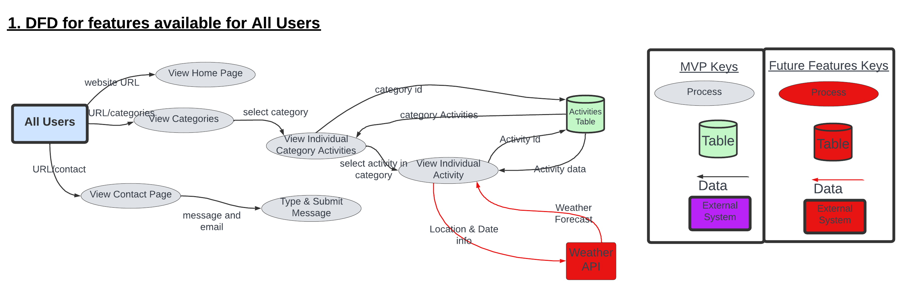
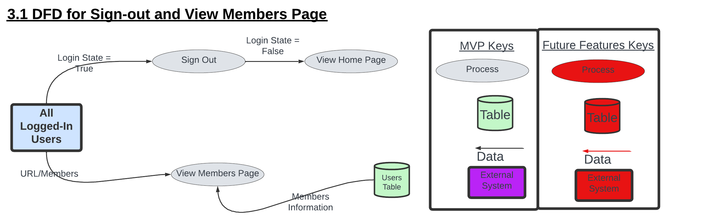
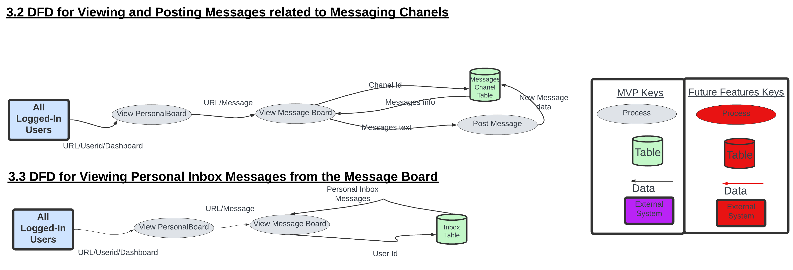
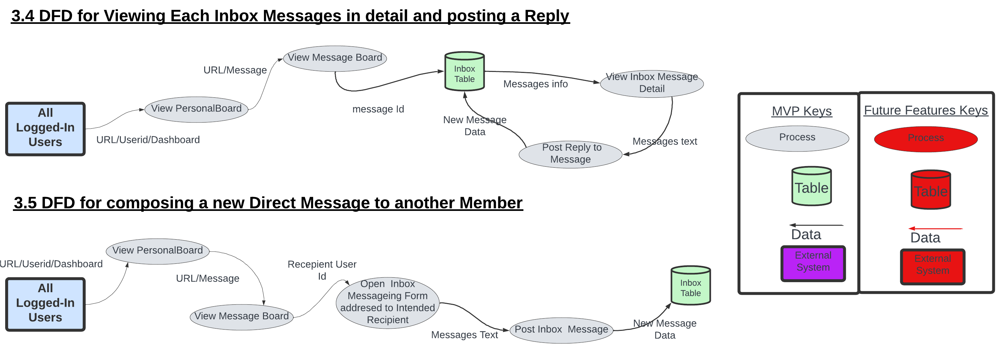
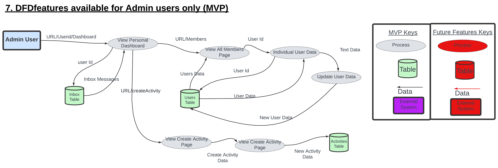
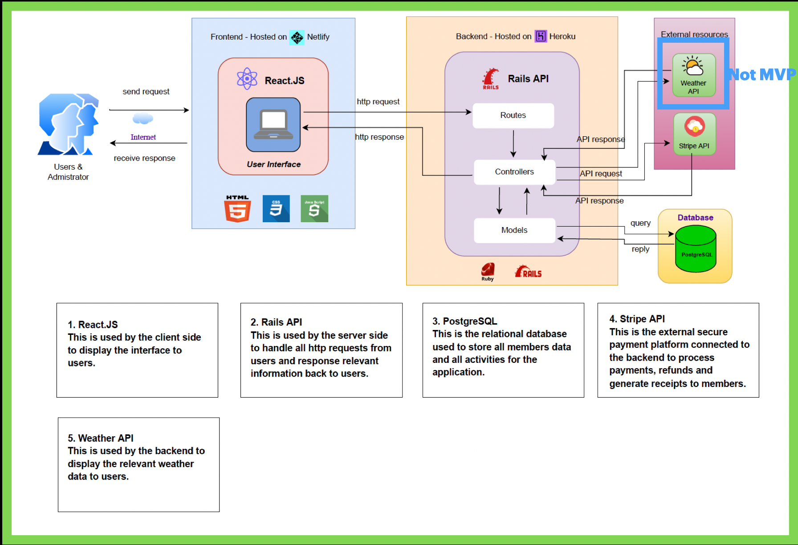

# Full Stack App (Part A)

## Description of the application

Sports-4-Us is an App that that helps people from all walks of life, to **join** and **participate** in a wide variety of **sporting activities** of their *choice* and at times *flexible* for them.

### Purpose

The main purpose behind Sports-4-Us is to try build an Application that will make it easier for more people to  ***participate in sports***.

Studies show that living an active life style through sports participation generally improves lives of individuals in the following ways:

- Improved Mental Health and Social Wellness,
- Improved Physical Health and Fitness,
- Improved Sleep,
- Improved Energy Levels and
- Reduced risk of serious illnesses and chronic diseases.

All these factors improve the quality of life and the capacity of an individual to be more productive. Hence, with more individuals taking part in sports, it helps to build a **happier**, **healthier** and **more productive world** and one that will need less money to be spend on health services and health infrastructure. 

Despite all the well known benefits that come with sports participation, many individuals experience numerous barriers when trying to take part in sports. Some of the barriers experienced by individuals, as mentioned by the Australian Sports Commission *(Australian Sports Commission, 2022) are the following:

- **Time:** Families and individuals are getting busier by the day and finding less time to commit to sporting activities. Lot of sporting activities have very inflexible schedule that can be unsuitable for individuals involved in full time work and families.
- **Cost:** The cost to register for sports can be quite unaffordable for many individuals and families
Enjoyment: Not everybody is drawn to sports that are competitive in nature and hence this might deter many individuals from taking part. Some people are looking for enjoyment and fitness only.
- **Self-Esteem:** Some individuals may not feel good enough for sports and hence might stay away from sports.
Risk: Some people may feel that sports could be dangerous and stay away to risk injuries.
Awareness: Individuals may not be aware of where the sporting activities are due to not being well connected socially.
- **Delivery:** Some sporting activities that are available might not be delivered well and informative enough for the general public feel interested.

Sports-4-Us tries to reduce all these barriers and increase participation by providing the following benefits:

- **Easily Accessible:** Sports-4-Us App will be easily accessible on the internet for anybody that can access the internet at no cost. This will ensure that almost all people and even people that were in the dark previously, with regard to sporting information can easily be aware. 
- **Affordable:** Joining fees and cost to join activities will be at a minimum because there is no need to employ too many people or maintain too much infrastructure for the sporting activities. Few admin personnel and sports organisers can service all the activities which keeps workers wages at a minimum. Facilities and programs are rented or accessed only when needed and hence there is no need to charge members high joining fees to maintain or buy facilities. 
- **Easy to Join:**  Joining only requires a very easy Sign up process and a minimal joining fee.
- **Informative:** The App will have extensive information on each activity which will ensure that people from all walks of live will be made fully aware of the details of each program and how that could fit into everybody’s personal lives. 
- **Flexibility:** For people that have time constraints and inflexible working hours, it works ideal because joining the app does not require a long term commitment to any activity. People can choose to join short term activities when they choose, withdraw after that and later join again when they are free again.
- **Easy to Contact:** The app provides contact forms and messaging Channels to communicate with administrators and organisers when quite easily. This will clear any doubts, issues or concerns people may have around things like self-esteem and risks.
- **Lots of Choice:** Joining the app allows the user to choose from a wide range of activities throughout their membership which allows them to experience various sports and opportunities to network with lots of different people.

****Refference***

Australian Sports Commision (2022) Drivers and barriers of participation. Available at: https://www.sportaus.gov.au/participation/drivers/barriers
(Accessed: 12 July 2022).

### Functionality / features

In order to understand the full functionality of Sport-4-Us App, it is important to examine it from the perspective of each of the four different types of users, that will be using the Application:

**Guest Users**

Guest Users are anybody that uses the Application and are not Signed up as a User and hence cannot Log In to the application under any capacity. These users can still use the application but to a much limited capacity. They can more specifically do the following:

- View the Home Page
- Explore through the different Categories of  Activities available and also the specific Activities within each category in detail.
- They can also contact the Administrators of the application by typing a message in the Contact Page.
- If they later decide to be a Member or an Organiser of the Activities, they can then Sign Up using the Sign up Page.

All the above features are what has been decided to be part of the ***Minimum Viable Product*** for design of the Application. Once all that has been implemented the developers hope to implement the following to enrich the Application:

- a payment system during Sign Up to ensure that the users can be charged a ‘Joining fee’ to secure membership.
- A Weather Forecast for the day each of the activity will take place.

**Members**

Members are the ones who will be choosing from the different activities available and eventually participating in them. To be more specific, they will have access to all the following features:

- All the features that are available to Guest Users,
- Signing In as a User,
- Booking suitable activity or activities,
- Paying for suitable activities to Participate
- Viewing Personal Messages from other members, organisers and Administrators,
- Messaging and replying to other members, organisers and Administrators using direct messaging,
- Posting messages in different Messaging channels
- Editing their Personal Profiles,
- Viewing list of Activities that they will be participating in.
- Viewing a list of all the Members and Organisers registered in the App.

**Organisers**

Organisers are the ones who will be in charge of organising the different activities and communicating with members regarding details of each activity. To be more specific, the will have access to all the following features:

- All the features that are available to Guest Users,
- Signing In as a User,
- Viewing Personal Messages from other members, organisers and Administrators,
- Messaging and replying to other members, organisers and Administrators using direct messaging,
- Posting messages in different Messaging channels
- Editing their Personal Profiles,
- Viewing list of Activities that they will are Organising.
- Viewing a list of all the Members and Organisers registered in the App.

All the above features are what has been decided to be part of the ***Minimum Viable Product*** for design of the Application. Once all that has been implemented the developers hope to implement the following to enrich the Application:

- The Organisers will be able to Create their own Activities and submit it to Administrators for Approval.
- They will have a page to view all the Activities that have been created but are still waiting to be approved by the Administrators.

**Administrators**

Administrators are the people that are responsible for administrative functions regarding the application. To be more specific they will have access to the following features:

- All features that are available to Guest users.
- Signing In as a User,
- Viewing Personal Messages from other members, organisers and Administrators,
- Messaging and replying to other members, organisers and Administrators using direct messaging,
- Posting messages in different Messaging channels
- Editing Personal Profiles of All users,
- Deleting Users
- Viewing a list of all the Members and Organisers registered in the App.
- Creating Activities
- Assigning Users as Members and Organisers,

All the above features are what has been decided to be part of the ***Minimum Viable Product*** for design of the Application. Once all that has been implemented the developers hope to implement the following to enrich the Application:

- Admin will be in a position to Accept or Reject Activities created by Organisers,
- Admin will be able to view a list of Activities that are waiting to be approved.

### Target audience
This app will be aimed at people who have different age and background but only want to have healthy lifestyle and closer social relationship with others by attending regular sports and physical activities.

### Tech stack

- Front-end: HTML5, CSS3, REACT.JS, JavaScript, JSX, AXIOS, Material-ui.

- Back-end: Rails API

- Database: postgreSQL

- Deployment:
1. Front-end: Netlify
2. Back-end: Heroku

- Testing:
1. Front-end: Jest
2. Back-end: Rspec

Project management tools: Trello, Discord

Utilities: diagrams.net, Balsamiq Wireframes

DevOps: Git, Github, VS Code

## Dataflow Diagram

## Application Architecture Diagram

The one thing to note in the above Architecture Diagram is that the implementation of the system accessing the Weather API is not part of the MVP(Minimum Viable Product) design. It is a feature that will be implemented once all the MVP features have been sucessfully implemented.
## User Stories

### Initial market research:

### Final market research:

| AS A..    | I WANT TO..                                                       | SO THAT..                                                                             |
|-----------|-------------------------------------------------------------------|---------------------------------------------------------------------------------------|
| Guest     | I want to explore various sporting activities.                    | I can decide whether I should sign up as a member to attend sports activities.        |
| Guest     | I want to sign up as a member.                                    | I can book any available sports activity/activities that I will like to take part in. |
| Guest     | I want to contact admin of this website.                          | I can make some enquiries.                                                            |
| Member    | I want to manage my profile.                                      | I can keep it up to date.                                                             |
| Member    | I want to inquire about a particular activity with the organiser. | I can know more information about the activity like equipment, location etc.          |
| Member    | I want to make a payment after booking the activity.              | I can get a ticket to attend the activity.                                            |
| Member    | I want to message other members, organisers or admin.             | We can communicate directly.                                                          |
| Member    | I want to see my personal dashboard.                              | I can find all my registered activities and messages.                                 |
| Member    | I want to see all members' briefing information.                  | I can find someone from the same location, who has the same interests.                |
| Member    | I want to be an activity organiser                                | I can organise my own activities.                                                     |
| Organiser | I want to see my dashboard.                                       | I can see all my organised activities and messages.                                   |
| Organiser | I want to see all members' briefing information                   | I can monitor what activities is more popular.                                        |
| Organiser | I want to reply to messages from members.                         | I can quickly answer all enquiries related to the activity.                           |
| Admin     | I want to have a dashboard.                                       | I can manage all activities, messages and members in one place.                       |
| Admin     | I want to be able to manage activities.                           | I can create, update and delete activity as needed                                    |
| Admin     | I want to be able to manage member's profile.                     | I can keep it up to date or delete the member.                                        |
| Admin     | I want to be able to answer general enquiries.                    | I can reply the messages sent to me from the contact page.                            |

## Wireframes for multiple standard screen sizes, created using industry standard software

### A. Wireframes - User Not Logged-In

**1 - Home Page**

**2 - All Activity Categories**

**3 - Category Activities**

**4 - Activity Detail**

**A.5 - Contact Page**

**6 - SignUp Page**

**7 - Joining Fee Payment(Not MVP)**

### B. Wireframes - Member Login

**1 - Login**

**2 - Member Dashboard**

**B.3 - Profile**

**4 - Members**

**5 - Direct Message Form**

**6 - Participating Activities Page**

**7&8 - Message Board Page/Inbox Channel**

**9 - Direct Message Reply Form**

**10 - General Channel Page**

**11 - Sport Category  Channels**

**12 - Past Activities(Not MVP)**

### C. Wireframes - Organiser Login

**1 - Organiser Dashboard**

**2 - Profile**

**3 - Organised Activities**

**4 - View Members(Not MVP)**

**5 -  Direct Message Form(Not MVP)**

**6 - Direct Message Reply Form(Not MVP)**

**7 - Create Activity Page(Not MVP)**

**8 - Past Activities(Not MVP)**

**9 - Activities Pending Approval(Not MVP)** 

**10 - Pending Activity Detail(Not MVP)**

### Wireframes - Admin Login**1**

**1 - D. Admin Dashboard**

**2 - Edit User Profile**

**3 - Direct Message Form**

**4 - Direct Message Reply Form**

**5 - Activity Pending Approval(Not MVP)**

**6 - Pending Activity Detail(Not MVP)**

## Screenshots of your Trello board throughout the duration of the project

Link to Trello Boards:

Part A - https://trello.com/b/HIMcvgnT/sports-4-us-part-a

Part B - https://trello.com/b/cmjtAiJB/sports-4-us-part-b

### Day 1

### Day 6

### Day 8

### Day 11

### Day 14

