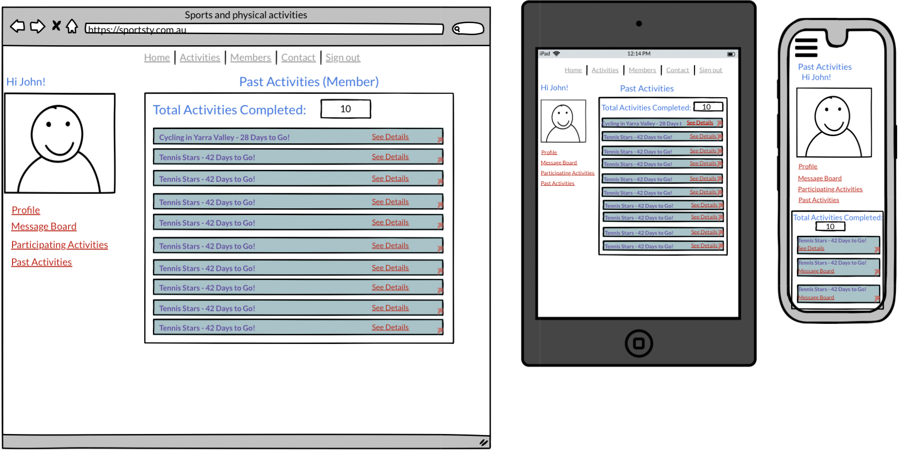
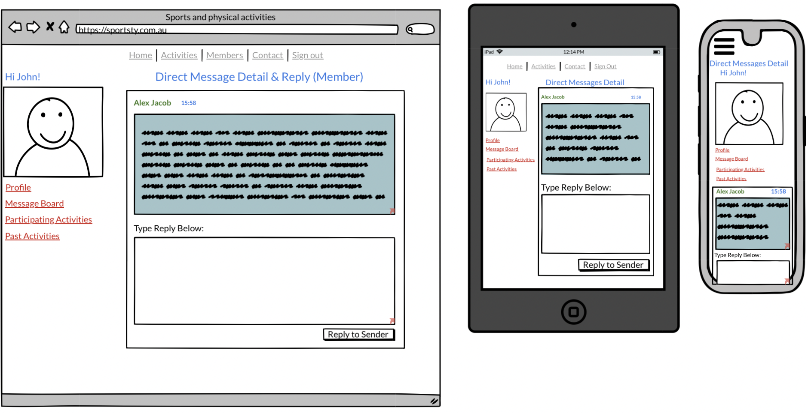
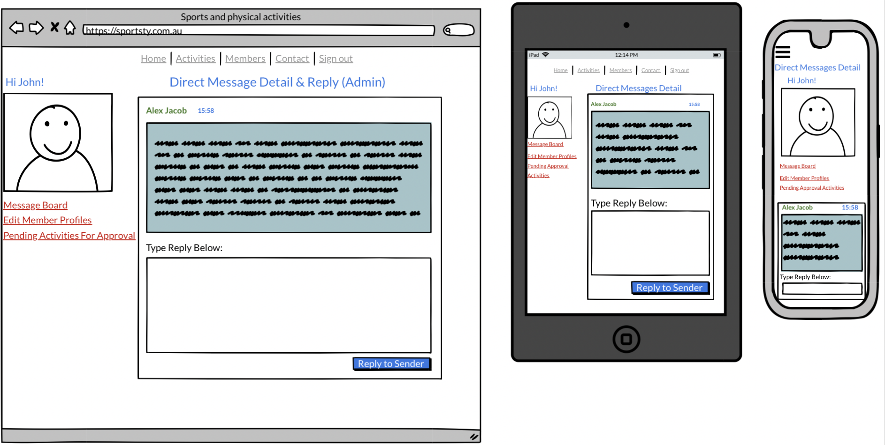

# Full Stack App (Part A)

## Description of the application

Sports-4-Us is an App that that helps people from all walks of life, to **join** and **participate** in a wide variety of **sporting activities** of their *choice* and at times *flexible* for them.

### Purpose

The main purpose behind Sports-4-Us is to try build an Application that will make it easier for more people to  ***participate in sports***.

Studies show that living an active life style through sports participation generally improves lives of individuals in the following ways:

- Improved Mental Health and Social Wellness,
- Improved Physical Health and Fitness,
- Improved Sleep,
- Improved Energy Levels and
- Reduced risk of serious illnesses and chronic diseases.

All these factors improve the quality of life and the capacity of an individual to be more productive. Hence, with more individuals taking part in sports, it helps to build a **happier**, **healthier** and **more productive world** and one that will need less money to be spend on health services and health infrastructure. 

Despite all the well known benefits that come with sports participation, many individuals experience numerous barriers when trying to take part in sports. Some of the barriers experienced by individuals, as mentioned by the Australian Sports Commission (Australian Sports Commission, 2022) are the following:

- **Time:** Families and individuals are getting busier by the day and finding less time to commit to sporting activities. Lot of sporting activities have very inflexible schedule that can be unsuitable for individuals involved in full time work and families.
- **Cost:** The cost to register for sports can be quite unaffordable for many individuals and families
Enjoyment: Not everybody is drawn to sports that are competitive in nature and hence this might deter many individuals from taking part. Some people are looking for enjoyment and fitness only.
- **Self-Esteem:** Some individuals may not feel good enough for sports and hence might stay away from sports.
Risk: Some people may feel that sports could be dangerous and stay away to risk injuries.
Awareness: Individuals may not be aware of where the sporting activities are due to not being well connected socially.
- **Delivery:** Some sporting activities that are available might not be delivered well and informative enough for the general public feel interested.

Sports-4-Us tries to reduce all these barriers and increase participation by providing the following benefits:

- **Easily Accessible:** Sports-4-Us App will be easily accessible on the internet for anybody that can access the internet at no cost. This will ensure that almost all people and even people that were in the dark previously, with regard to sporting information can easily be aware. 
- **Affordable:** Joining fees and cost to join activities will be at a minimum because there is no need to employ too many people or maintain too much infrastructure for the sporting activities. Few admin personnel and sports organisers can service all the activities which keeps workers wages at a minimum. Facilities and programs are rented or accessed only when needed and hence there is no need to charge members high joining fees to maintain or buy facilities. 
- **Easy to Join:**  Joining only requires a very easy Sign up process and a minimal joining fee.
- **Informative:** The App will have extensive information on each activity which will ensure that people from all walks of live will be made fully aware of the details of each program and how that could fit into everybody’s personal lives. 
- **Flexibility:** For people that have time constraints and inflexible working hours, it works ideal because joining the app does not require a long term commitment to any activity. People can choose to join short term activities when they choose, withdraw after that and later join again when they are free again.
- **Easy to Contact:** The app provides contact forms and messaging Channels to communicate with administrators and organisers when quite easily. This will clear any doubts, issues or concerns people may have around things like self-esteem and risks.
- **Lots of Choice:** Joining the app allows the user to choose from a wide range of activities throughout their membership which allows them to experience various sports and opportunities to network with lots of different people.

### Functionality / features

### Target audience
This app will be aimed at people who have different age and background but only want to have healthy lifestyle and closer social relationship with others by attending regular sports and physical activities.

### Tech stack

- Front-end: HTML5, CSS3, REACT.JS, JavaScript, JSX, AXIOS, Material-ui.

- Back-end: Rails API

- Database: postgreSQL

- Deployment:
1. Front-end: Netlify
2. Back-end: Heroku

- Testing:
1. Front-end: Jest
2. Back-end: Rspec

Project management tools: Trello, Discord

Utilities: diagrams.net, Balsamiq Wireframes

DevOps: Git, Github, VS Code

## Dataflow Diagram

## Application Architecture Diagram

## User Stories

### Initial market research:
three personas of users:
- Jason Smith (Male, age 20) 
-- As a student I want to join different sports activities like tennis, soccer everyweek and make more young friends.

- Melinda Jacob (Female, age 35)
-- As a mum of two kids I want to join mild activity like running to release life pressure and talk to others with similar situation.

- John Brown (Male, age 62)
-- As a retired professor I want to join light physical activity like hiking to keep health and explore more nature scenery.

### Final market research:
#### Non-member user stories:
- As a non-member user I want to explore all activities before I can decide whether I will sign up as a member to attend sports activities.
- As a non-member user I want to sign up as a member so that I can register any available sports activities.
- As a non-member user I want to contact admin of this website so that I can make some enquiries.
#### member user stories:
- As a member I want to manage my profile so that I can keep it up to date.
- As a member I want to inquire to particular activity or organiser so that I can know better about the activity like equipment, location etc.
- As a member I want to make a payment after register the activity so that I can get a ticket to attend the activity.
- As a member I want to message other members or admin so that we can communicate directly.
- As a member I want to see my personal dashboard so that I can find all my registered activities.
- As a member I want to see all members' briefing information so that I can find someone has same interests and location.
- As a member I want to be an activity organiser so that I can organise my own activities.
#### organiser user stories:
- As an organiser I want to see my dashboard so that I can see all my organised activities.
- As an organiser I want to see all members' briefing information so that I can monitor what activities is more popular.
- As an organiser I want to reply messages from members so that I can quickly answer all enquiries related to the activity.
#### admin user stories:
- As an admin I want to have a dashboard so that I can manage all activities and members in one place.
- As an admin I want to be able to manage activities so that I can create, update and delete activity as needed.
- As an admin I want to be able to manage member's profile so that I can keep it up to date.
- As an admin I want to be able to answer general enquiries so that I can reply the messages sending from contact page.

## Wireframes for multiple standard screen sizes, created using industry standard software

![22]](Wireframes/22.png)

## Screenshots of your Trello board throughout the duration of the project

### Day 1

### Day 6

### Day 8

### Day 11
### Day 14